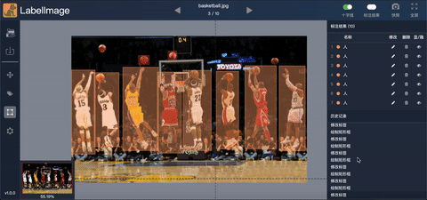

原模型：[LabelImage](https://github.com/rachelcao277/LabelImage)，请支持作者！

# 描述
与后端相结合的图像标注前端。
# 功能清单
- [x] 接入后端，下载图片，上传标注
- [x] 矩形标注
- [x] 图片拖拽，缩放，缩略图显示
- [x] 鼠标十字线，标签名显示控制
- [x] 标注结果编辑修改、删除
- [x] 操作管理历史记录

# 使用方法

#### 拖拽模式
按D键（或左边栏第二个按钮）进入拖拽模式。在拖拽模式下，可以按下鼠标左键，对图片进行拖拽。还可以对标注框按下左键，进行拖拽。点击标注框，其四个顶点会出现小圆点，可以进行大小调整。

#### 标注模式
按F键（或左边栏第三个按钮）进入标注模式。按下鼠标左键可以绘制矩形。抬起后，绘制完毕，最新的标注框四个顶点出现小圆点，可以进行调整；也可以继续绘制。

**标注模式下拖拽小圆点的行为和拖拽模式是相同的。**

**在标注模式下，按下鼠标右键，就如同拖拽模式按下左键，可以拖拽图片和标注框。**

#### 删除

按R键可以删除选中的（也即带有小圆点的）标注框。

#### 缩放

用滚轮进行缩放。手指向上推动滚轮是放大，向下推动是缩小。**不要用Ctrl+滚轮。**

#### 右边栏标注结果查看

从后端发来的标注数据初始按照从右到左、从上到下排序，以便于查看。新的标注框会附加在列表后面。

#### 历史记录操作示例

单击右下角的历史记录栏中的项目，可以恢复标注结果到之前的某一个状态。

  

#### 上传

在绘制、拖拽、删除标注框后都会自动上传标注数据。

在切换图片时，也会上传标注数据。

**查看历史数据时不会自动上传。**

手动上传按钮是左栏第一个，快捷键为Ctrl+S。

#### 切换图片

用Q切换上一张图，W切换下一张图。

顶栏也可以切换上一张、下一张。

#### 恢复到初始

**慎重：该操作无法撤销**

右上角“恢复”按钮会将标注结果恢复到初始状态。

# 最佳实践

#### 姿势

左手键盘，右手鼠标为佳。

#### 快捷键一览

**快捷键对应的是键位而不是字符，不分大小写。**

- Q, W：上一张，下一张
- D：拖拽模式
- F：标注模式
- R：删除当前标注框
- Ctrl+S：上传

#### 标注

利用**食指**F切换至标注模式进行标注。

若误标注，用**食指**R删除。若标注有偏差，可以拖拽小圆点进行修改，或者右键拖拽标注框。

用滚轮缩放，手指向上推动滚轮是放大，向下推动是缩小。

用右键拖拽图片来切换视角。或利用**中指**D切换至拖拽模式后用左键拖拽。

用右键拖拽已存在的标注框。或利用**中指**D切换至拖拽模式后用左键拖拽。

#### 切换

Q**小指**上一张，W**无名指**下一张。

#### 起身放松

如果有强迫症，或者是移动过历史记录，记得按一下Ctrl+S。

# 要求
- Ubuntu / macOS / Windows
- Chrome v51+ / Firefox v53+

